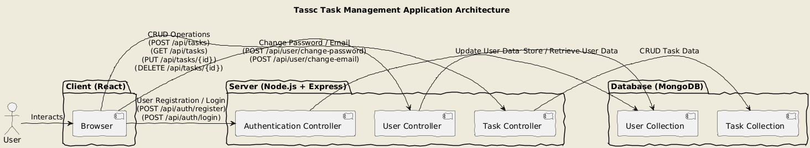

```

### API Documentation

**docs/api-documentation.md**
```markdown
# API Documentation

## Authentication

### Register

- **URL**: `/api/auth/register`
- **Method**: `POST`
- **Body**:
  ```json
  {
    "email": "user@example.com",
    "password": "Password123"
  }
  ```
- **Success Response**:
  - **Code**: `201 Created`
  - **Content**: `{ "token": "jwt_token" }`

### Login

- **URL**: `/api/auth/login`
- **Method**: `POST`
- **Body**:
  ```json
  {
    "email": "user@example.com",
    "password": "Password123"
  }
  ```
- **Success Response**:
  - **Code**: `200 OK`
  - **Content**: `{ "token": "jwt_token" }`

## User

### Change Password

- **URL**: `/api/user/change-password`
- **Method**: `POST`
- **Headers**: `{ "Authorization": "Bearer jwt_token" }`
- **Body**:
  ```json
  {
    "oldPassword": "OldPassword123",
    "newPassword": "NewPassword123"
  }
  ```
- **Success Response**:
  - **Code**: `200 OK`
  - **Content**: `{ "message": "Password changed successfully" }`

### Change Email

- **URL**: `/api/user/change-email`
- **Method**: `POST`
- **Headers**: `{ "Authorization": "Bearer jwt_token" }`
- **Body**:
  ```json
  {
    "newEmail": "newuser@example.com"
  }
  ```
- **Success Response**:
  - **Code**: `200 OK`
  - **Content**: `{ "message": "Email changed successfully" }`

## Tasks

### Create Task

- **URL**: `/api/tasks`
- **Method**: `POST`
- **Headers**: `{ "Authorization": "Bearer jwt_token" }`
- **Body**:
  ```json
  {
    "taskName": "Task Name",
    "description": "Task Description",
    "status": "In Progress",
    "dueDate": "2024-07-30"
  }
  ```
- **Success Response**:
  - **Code**: `201 Created`
  - **Content**: `{ "task": { "id": "task_id", "taskName": "Task Name", "description": "Task Description", "status": "In Progress", "dueDate": "2024-07-30" } }`

### Get Tasks

- **URL**: `/api/tasks`
- **Method**: `GET`
- **Headers**: `{ "Authorization": "Bearer jwt_token" }`
- **Success Response**:
  - **Code**: `200 OK`
  - **Content**: `[ { "id": "task_id", "taskName": "Task Name", "description": "Task Description", "status": "In Progress", "dueDate": "2024-07-30" } ]`

### Update Task

- **URL**: `/api/tasks/:id`
- **Method**: `PUT`
- **Headers**: `{ "Authorization": "Bearer jwt_token" }`
- **Body**:
  ```json
  {
    "taskName": "Updated Task Name",
    "description": "Updated Task Description",
    "status": "Completed",
    "dueDate": "2024-08-01"
  }
  ```
- **Success Response**:
  - **Code**: `200 OK`
  - **Content**: `{ "task": { "id": "task_id", "taskName": "Updated Task Name", "description": "Updated Task Description", "status": "Completed", "dueDate": "2024-08-01" } }`

### Delete Task

- **URL**: `/api/tasks/:id`
- **Method**: `DELETE`
- **Headers**: `{ "Authorization": "Bearer jwt_token" }`
- **Success Response**:
  - **Code**: `200 OK`
  - **Content**: `{ "message": "Task deleted successfully" }`
```

### High-Level Design (HLD)

**docs/high-level-design.md**
```markdown
# High-Level Design

## Overview

Tassc is a task management application that allows users to manage their tasks efficiently. The system is designed with a client-server architecture, where the frontend is built with React and the backend with Node.js and Express. The database used is MongoDB.

## Architecture Diagram



## Components

### Client

- **React**: For building the user interface.
- **Axios**: For making HTTP requests to the backend.
- **Formik & Yup**: For form handling and validation.
- **React Router**: For client-side routing.
- **React Toastify**: For displaying notifications.
- **jsPDF**: For generating PDF files of tasks.

### Server

- **Node.js & Express**: For building the backend API.
- **MongoDB & Mongoose**: For database and ORM.
- **JWT**: For user authentication.
- **Bcrypt**: For password hashing.
- **Nodemailer**: For sending emails.

## Data Flow

1. **User Registration and Authentication**:
   - Users register and log in using email and password.
   - Passwords are hashed using Bcrypt before being stored in the database.
   - JWT tokens are issued for authenticated sessions.

2. **Task Management**:
   - Users can create, read, update, and delete tasks.
   - Each task has a name, description, status, due date, and is associated with a user.
   - Tasks are automatically deleted if the due date has passed.

3. **Email and Password Management**:
   - Users can request password resets.
   - Password reset links are sent via email.
   - Users can change their email and password from their profile.

4. **PDF Export**:
   - Users can export their tasks to a PDF file using jsPDF.

## API Endpoints

See the [API Documentation](./api-documentation.md) for detailed API information.

## Database Schema

### User

```json
{
  "_id": "ObjectId",
  "email": "string",
  "password": "string",
  "resetPasswordToken": "string",
  "resetPasswordExpires": "Date"
}
```

### Task

```json
{
  "_id": "ObjectId",
  "taskName": "string",
  "description": "string",
  "status": "string",
  "dueDate": "Date",
  "userId": "ObjectId"
}
```

## Security

- **Password Hashing**: User passwords are hashed using Bcrypt before storing them in the database.
- **Authentication**: JWT tokens are used to secure API endpoints.
- **Input Validation**: Formik and Yup are used to validate user inputs on the client side.

## Future Enhancements

- **Role-based Access Control**: Implement roles such as admin, manager, and user.
- **Task Sharing**: Allow users to share tasks with other users.
- **Notifications**: Implement real-time notifications for task updates.

## Conclusion

Tassc is a comprehensive task management solution designed to help individuals and teams manage their tasks

 efficiently. With a robust backend and user-friendly frontend, Tassc provides a seamless user experience for task management.
```